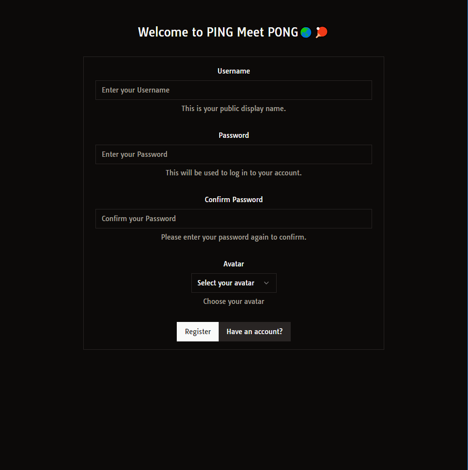
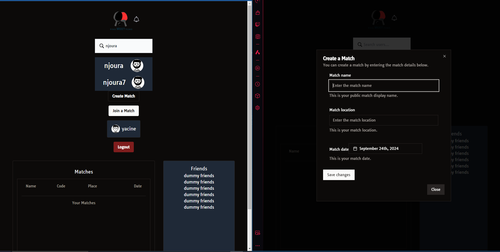
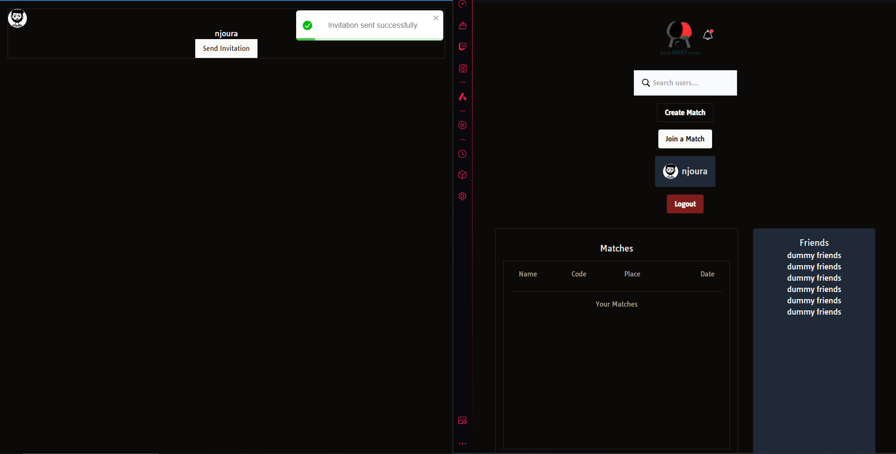

# PingMeetPong Frontend

## 👋 Introduction

PingMeetPong is a dynamic and engaging platform designed to connect users through interactive gaming experiences. This repository contains the frontend codebase for the PingMeetPong platform.

## ✨ Features

- ✅ User Authentication
- ✅ Create games
- ✅ Search for players
- User interactions:
  - ✅ send invitations and receive in real time with socket.io
  - ✅ accept/decline invitations
  - [ ] creating chat rooms for each game with socket.io
- Enhance user profile:
  - [ ] better UI (including Bio)
  - [ ] player history
  - [ ] recommendations & feedbacks

## 🛠️ Tech Stack

- React
- TypeScript
- TailwindCSS
- Socket.io

## Getting Started

To get a local copy up and running follow these simple steps.

### Prerequisites

- npm
  ```sh
  npm install npm@latest -g
  ```

### Installation

- Clone the repo

```sh
git clone https://github.com/Njoura7/pingMeetPong-frontend.git
```

Install NPM packages

```sh
npm install
```

We also need to create a cluster for our MongoDB, check the backend repo

Run on localhost

```sh
npm run dev
```

### 📸Screenshots

Here are some screenshots that illustrate the application in action:

<div align="center">
  
  <p><em>Welcome Page</em></p>

  
  <p><em>Search Friends / Create Games</em></p>

  
  <p><em>User Profile Interactions & Notifications</em></p>
  <br/>
  <br/>

  <p><em>The best is yet to come...</em></p>
</div>

### Contributing

Contributions are what make the open-source community such an amazing place to learn, inspire, and create. Any contributions you make are greatly appreciated.

## 🤝 Connect with Me

<div align="center">

[](https://www.linkedin.com/in/anasmohamedaziznjr/)
[](https://github.com/Njoura7)
[](https://x.com/njoura7)
[](https://dev.to/njoura7)

</div>

## 📫 Contact

- Email: njourawebdev@gmail.com
- Project Link: [PingMeetPong Frontend](https://github.com/Njoura7/pingMeetPong-frontend)

## 📜 License

Distributed under the MIT License. See LICENSE for more information.
